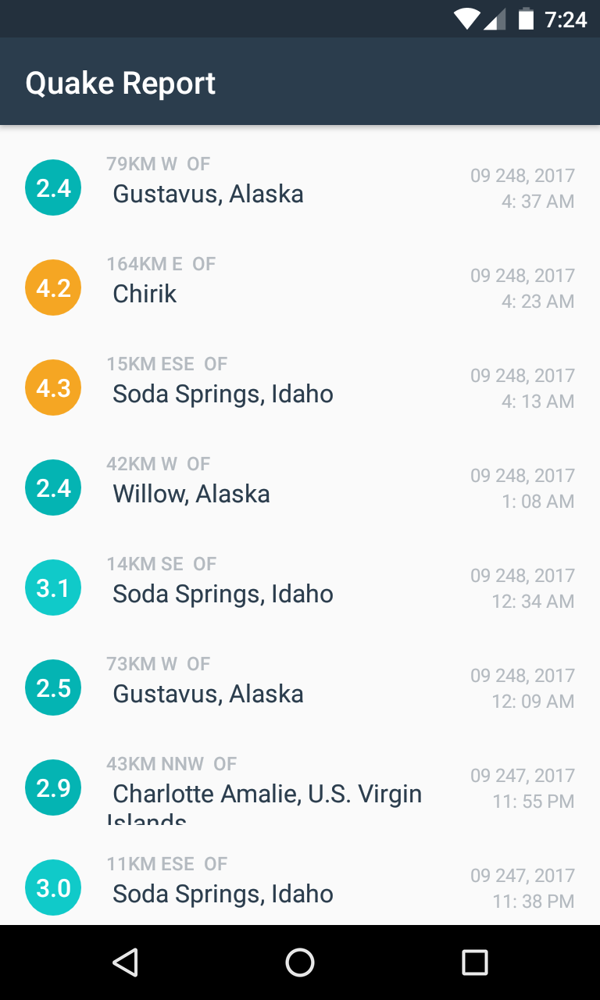

# QuakeReport

## Description
- This app displays a list of recent earthquakes in the world
from the U.S. Geological Survey (USGS) organization.

## What I've learned :
- Using AsyncTasks to connect to the internet.
- Using AsyncTasksLoader to connect to the internet.
- Reading and parsing JSON data.
- Customizing ListViews,using ArrayLists & ArrayAdapters.
- Using progress bar and listview empty for better UX

# Screenshots

